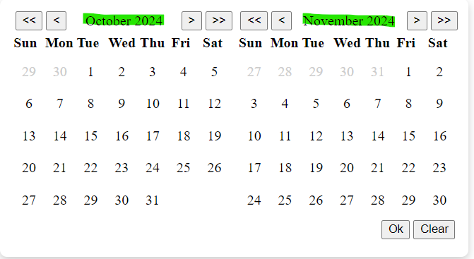
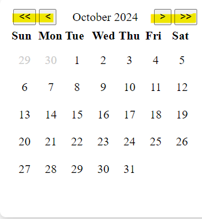
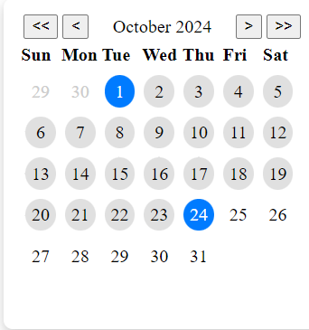

# DateRangePicker

Demo: [Demo](https://shailesh1297.github.io/date-range-picker/)

This project was generated with [Angular CLI](https://github.com/angular/angular-cli) version 18.2.8.

## Development server

Run `ng serve` for a dev server. Navigate to `http://localhost:4200/`. The application will automatically reload if you change any of the source files.

## Build
Run `ng build` to build the project. The build artifacts will be stored in the `docs/` directory.

Run `npm run build-docs` to build the project with base-href `date-range-picker` for github pages. The build artifacts will be stored in the `docs/` directory.

# Date Picker Component

This is component is a double paned date range picker. It contains two calendar panes differing by a month. 

Every calendar pane contains 4 navigation buttons -  
 `<` & `>` - navigating between months  
 `<<` & `>>` - navigating between years  
 

 Selecting Range  
 Step-1 :- Click on any date to select it as start date.(`Start date will be highlighted`)  
 Step-2 :- Again Click on any date that comes after selected start date. (`End date will be highlighted`)  
 Step-3 :- Click on `Ok` to submit the input 

## Inputs
`mode` | value: `basic` or `advanced` | Default Value: `basic` |
description:
- `basic` mode will render a simple date range picker with a no restriction on date range.
- `advanced` mode will render a date range picker with a restriction on date range & allow other inputs to be functional

`maxDateRange` | value: `number` | Default value: `30` |
description:
- The Date Range should be in  `advanced` mode.
- The maximum number of days allowed between the start and end dates.

`excludeDays` | value: `comma separated string` | Default value: `0,6`
description:
- The Date Range should be in `advanced` mode.
- The days of the week to exclude from the date range picker (0 = Sunday, 1 = Monday.....so on)

`disablePastDates` | value: `boolean` | Default value: `false`
description:
- The Date Range should be in `advanced` mode.
- Whether to disable past dates from the date range picker.

# Technology

- Angular version 18
- Typescript
- SCSS

## Implementation & Architecture
<ul>
    <li>The component is implemented using Angular and Typescript. The architecture is based on the <b>Angular component lifecycle hooks, signals & side effects </b>.</li>
    <li> The component is extending <b>control value accessor</b> <i>(Making it form control similar to a input or select control)</i> Thus could be used alongside other form controls in a form. </li>
    <li> Component is responsive and work on mobile, tablet & Desktop. <b>(using CSS media queries)</b></li>
    <li> Selector could be accessible with keyboard. </li>
</ul>

